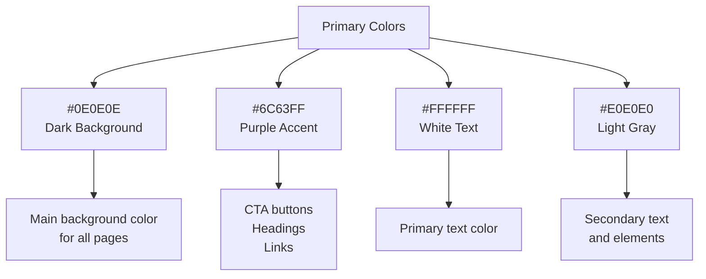

# Zentra Color Palette

```mermaid
graph TD
    A[Primary Colors] --> B[#0E0E0E<br/>Dark Background]
    A --> C[#6C63FF<br/>Purple Accent]
    A --> D[#FFFFFF<br/>White Text]
    A --> E[#E0E0E0<br/>Light Gray]
    
    B --> B1[Main background color<br/>for all pages]
    C --> C1[CTA buttons<br/>Headings<br/>Links]
    D --> D1[Primary text color]
    E --> E1[Secondary text<br/>and elements]
```