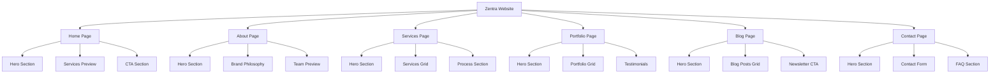

# Zentra Website Structure

```mermaid
graph TD
    A[Zentra Website] --> B[Home Page]
    A --> C[About Page]
    A --> D[Services Page]
    A --> E[Portfolio Page]
    A --> F[Blog Page]
    A --> G[Contact Page]
    
    B --> B1[Hero Section]
    B --> B2[Services Preview]
    B --> B3[CTA Section]
    
    C --> C1[Hero Section]
    C --> C2[Brand Philosophy]
    C --> C3[Team Preview]
    
    D --> D1[Hero Section]
    D --> D2[Services Grid]
    D --> D3[Process Section]
    
    E --> E1[Hero Section]
    E --> E2[Portfolio Grid]
    E --> E3[Testimonials]
    
    F --> F1[Hero Section]
    F --> F2[Blog Posts Grid]
    F --> F3[Newsletter CTA]
    
    G --> G1[Hero Section]
    G --> G2[Contact Form]
    G --> G3[FAQ Section]
```